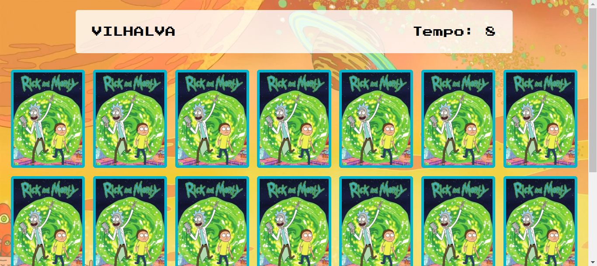

# JOGO DA MEMORIA
☑️JOGO EM HTML/CSS/JS.

 <br> 

## DESCRIÇÃO:
Este é um jogo de memória com cartas que contêm imagens de personagens. 

1. **Objetivo**: O objetivo do jogo é encontrar todos os pares de cartas que contenham imagens de personagens. Cada personagem aparece em duas cartas no tabuleiro.

2. **Início do Jogo**: Quando a página é carregada, o jogo começa. As cartas são dispostas em uma grade viradas para baixo, ocultando as imagens dos personagens.

3. **Jogando**: O jogador pode clicar em duas cartas por vez para revelar as imagens dos personagens. Se as imagens das duas cartas forem iguais, as cartas permanecem viradas para cima e são desativadas, indicando que foram combinadas com sucesso. Se as imagens forem diferentes, as cartas são viradas para baixo novamente após um curto intervalo de tempo.

4. **Temporizador**: Um temporizador começa a contar o tempo desde o início do jogo. O objetivo é encontrar todos os pares de cartas no menor tempo possível.

5. **Fim do Jogo**: O jogo termina quando todos os pares de cartas são encontrados e desativados. Nesse ponto, uma mensagem de parabéns é exibida, informando ao jogador o tempo total que levou para completar o jogo.

6. **Reinício**: Após o término do jogo, o jogador pode optar por reiniciar o jogo clicando em um botão correspondente. Isso reinicia o temporizador e redistribui as cartas no tabuleiro, permitindo que o jogador jogue novamente.

## COMO USAR?
* Clone o repositório para o seu sistema local:

```bash
git clone https://github.com/VILHALVA/JOGO-DA-MEMORIA.git
```

* Navegue até o diretório do projeto.

```bash
cd JOGO-DA-MEMORIA
```

* Descompacte o arquivo ZIP (se você baixou manualmente):

```bash
unzip JOGO-DA-MEMORIA.zip
```
* Abra o arquivo `index.html` em seu navegador de preferência.

## NÃO SABE?
- Entendemos que para manipular arquivos em `HTML`, `CSS` e outras linguagens relacionadas, é necessário possuir conhecimento nessas áreas. Para auxiliar nesse aprendizado, oferecemos cursos gratuitos disponíveis:
* [Curso de HTML e CSS](https://github.com/VILHALVA/CURSO-DE-HTML-E-CSS)
* [Curso de JavaScript](https://github.com/VILHALVA/CURSO-DE-JAVASCRIPT)
* [Confira mais cursos](https://github.com/VILHALVA?tab=repositories&q=+topic:CURSO)

## CREDITOS:
- [PROJETO CRIADO PELO "manualdodev"](https://github.com/manualdodev/memory-game)
- [PROJETO EDITADO PELO VILHALVA](https://github.com/VILHALVA)
- [ESTÁ DISPONIVEL NO SITE](https://vilhalva.github.io/STYLER/STYLER.html)